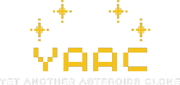
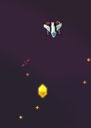
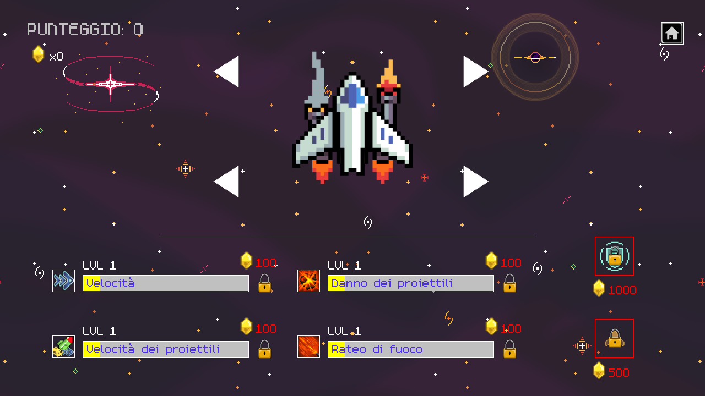
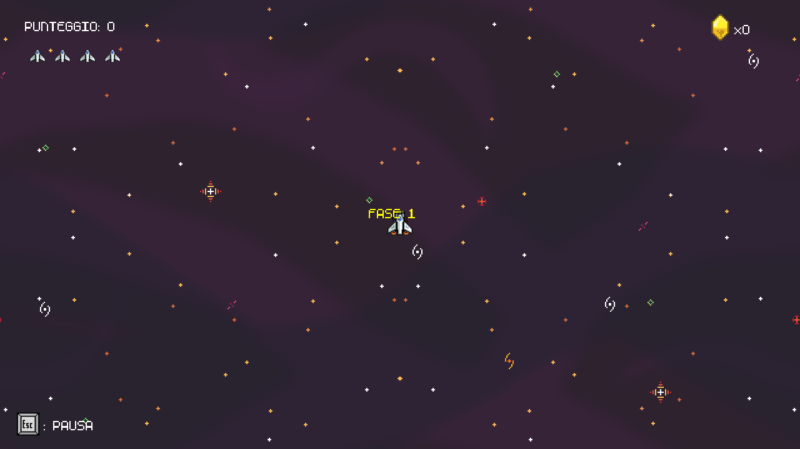
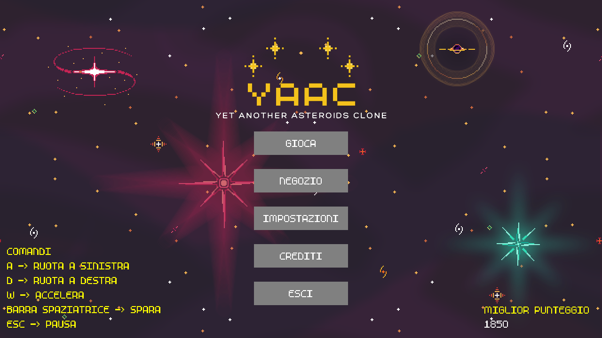
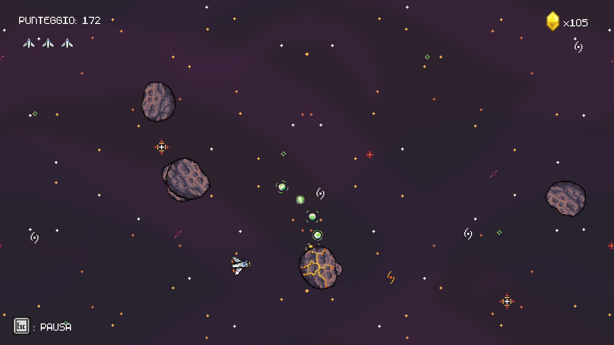
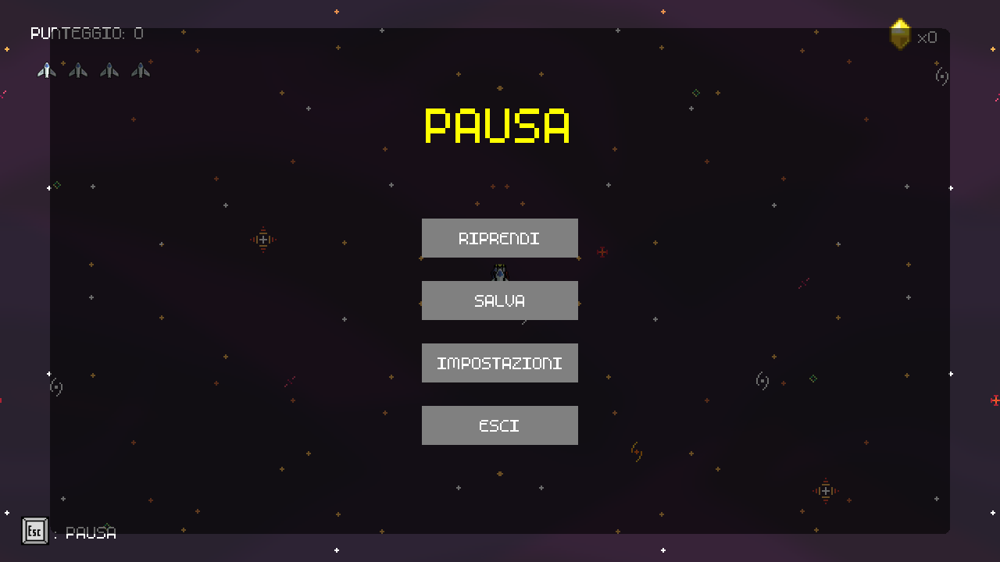
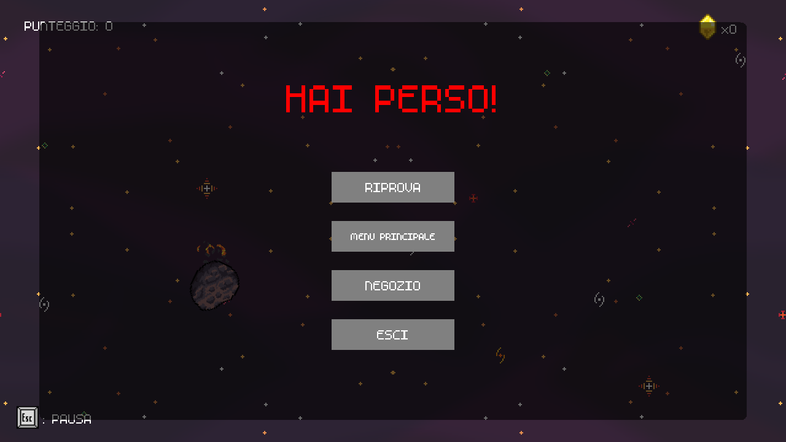
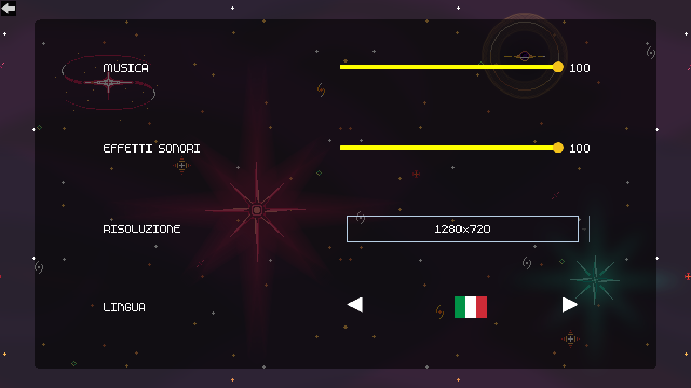
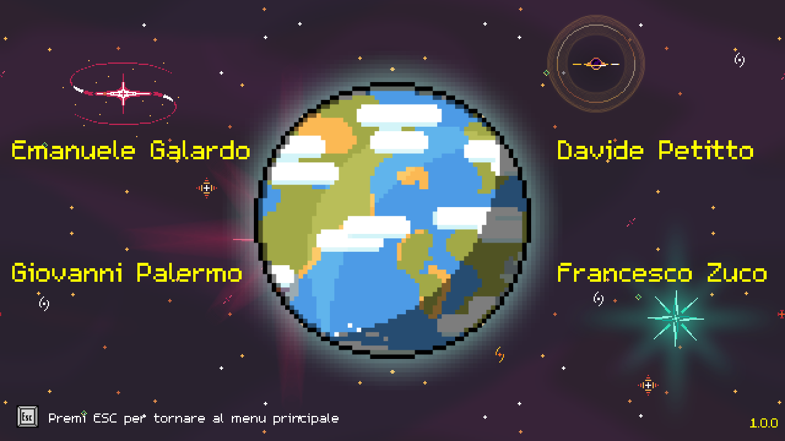

YAAC è un clone del celeberrimo Asteroids con alcune novità.

## Tutorial
L'obiettivo del gioco è semplice: distruggere quanti più asteroidi possibili.

Aumentando il punteggio è possibile sbloccare nuovi motori e armi per la navicella.

Nel menù principale verrà mostrato il punteggio più alto raggiunto.

Alcuni asteroidi rilasciano delle gemme, queste sono fondamentali per l'acquisizione di potenziamenti.

Lista di armi e motori con i punti necessari per lo sblocco

Motori:
- Motore Base - Sbloccato di base
- Motore Grande - 1000
- Motore a Scoppio - 2000
- Motore Super Carico - 3000

Armi:
- Cannone Base -
- Cannone Grande - 500
- Lanciarazzi - 1500
- Zapper - 2500

Una volta sbloccato armi e motori non è finita, dato che essi richiederanno alcuni miglioramenti per raggiungere il loro massimo potenziale.

Per scegliere i miglioramenti e i componenti da equipaggiare è necessario fare visita al negozio

### Negozio

Qui sarà possibile acquistare vari potenziamenti attraverso le gemme.

### Potenziamenti 
Costo da 100 a 900
- Velocità 
- Velocità dei proiettili
- Danno dei proietiili
- Rateo di fuoco

Sono anche disponibili dei potenziamenti temporanei al costo:
- Scudo - 1000
- Velocita - 500

### Gameplay
Il gioco è suddiviso in fasi progressivamente più difficili.

Punteggi per superare le varie fasi
- Fasi 1,2,3: 100 punti
- Fasi 4,5: 150 punti
- Fasi 6,7: 200 punti
- Fasi 8,9,10: 250 punti
- Fasi successive 300 punti

La fase successiva si attiverà quando verrà aggiunto l'ammontare di punti necessario al punteggio in base a quanto descritto sopra.

Gli asteroidi diventano più veloci all'aumentare delle fasi, quindi è necessario essere molto cauti e avere dei buoni potenziamenti per raggiungere le fasi più elevate.

### Salvataggio
Il gioco effettua l'autosalvataggio ogni 5 stage.

Tuttavia è possibile salvare il gioco manualmente.

Uscire da una partita in corso senza salvare comporta la perdita dei dati dell'ultima partita!

### Impostazioni
Sono disponibili le seguenti impostazioni
- Volume musica
- Volume effetti sonori
- Risoluzione
    - 1920x1080
    - 1280x720
- Lingua
    - Italiano
    - Inglese
    - Francese
    - Spagnolo
    - Giapponese
    - Calabrese

### Schermate di gioco

Gli assets sono presi da https://foozlecc.itch.io/
## Team Members
* Manu
* Giovanni
* Francesco
* Davide